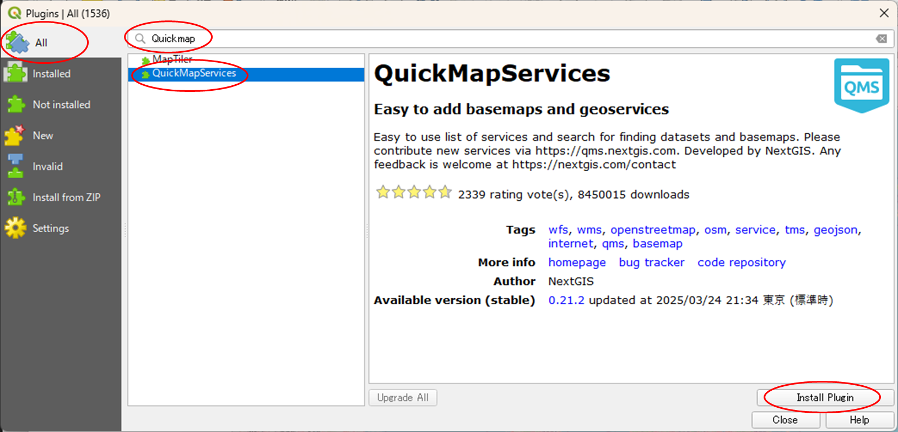
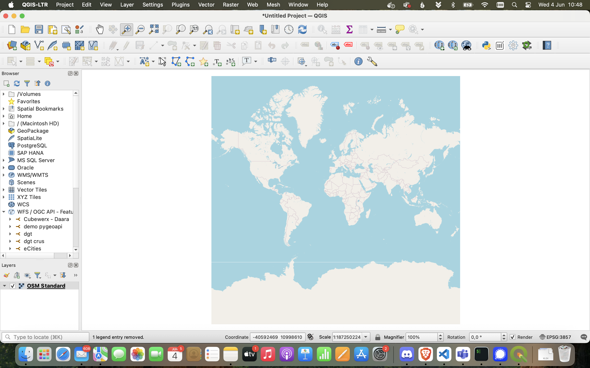
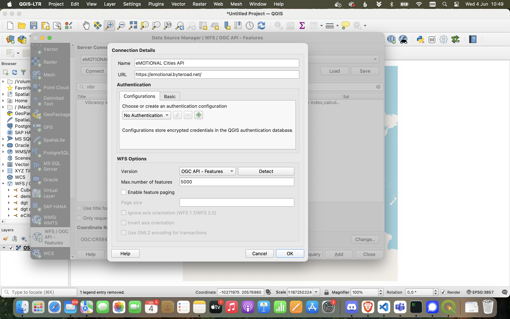

# QGIS

* [QGIS](https://qgis.org/) is a geographic information system (GIS) software that is free and open-source. QGIS supports Windows, macOS, and Linux. It supports viewing, editing, printing, and analysis of geospatial data in a range of data formats* (Wikipedia).

* _[QGIS](https://qgis.org/) es un software de sistema de información geográfica (SIG) que es gratuito y de código abierto. QGIS es compatible con Windows, macOS y Linux. Permite visualizar, editar, imprimir y analizar datos geoespaciales en una variedad de formatos de datos (Wikipedia)._

1. Install QuickMapService plugin, for a context map| _Instale el complemento QuickMapService para disponer de un mapa de contexto._

    `Pugins`/`Manage and Install Plugins`/`QuickMapServices`

    

2. Add a context map.| _Añada un mapa de contexto._

    

3. Add `WFS/OGC API - Features Layer...` from the Layer menu (or browser panel).| _Añada `WFS/OGC API - Features Layer...` desde el menú Capa (o panel del navegador)._

    

4. Instantiate a new server connection. Set connection details, using the Landing Page url - https://emotional.byteroad.net/ - and setting the maximum number of features (5000) to overcome the default server limits; remove paging. | _Cree una nueva conexión al servidor. Configure los detalles de la conexión usando la URL de la landing Page (https://emotional.byteroad.net/) y estableciendo el número máximo de features (5000) para superar los límites predeterminados del servidor; elimine la paginación._

    

5. Add the [Vibrancy Index collection](https://emotional.byteroad.net/collections/lisbon_vibrancy_index): `lisbon_vibrancy_index`. | _Añada la [Vibrancy Index collection](https://emotional.byteroad.net/collections/lisbon_vibrancy_index): `lisbon_vibrancy_index`._

    

6. Zoom to the layer extent. If you want, you can change the style by right-clicking on the layer to bring up the context menu and then selecting `properties`| _Acercar a la extensión de la capa. Si lo desea, puede cambiar el estilo haciendo clic derecho en la capa para abrir el menú contextual y seleccionando `propriedades`:_

    

You can find more information on how-to style layers in QGIS on [this](https://docs.qgis.org/3.40/en/docs/user_manual/working_with_vector/vector_properties.html#index-1) and [this](https://docs.qgis.org/3.40/en/docs/training_manual/vector_classification/label_tool.html) pages of the official documentation.

_Puede encontrar más información sobre cómo aplicar estilos a capas en QGIS en [esta](https://docs.qgis.org/3.40/es/docs/user_manual/working_with_vector/vector_properties.html#index-1) y [esta](https://docs.qgis.org/3.40/es/docs/training_manual/vector_classification/label_tool.html) páginas de la documentación oficial._