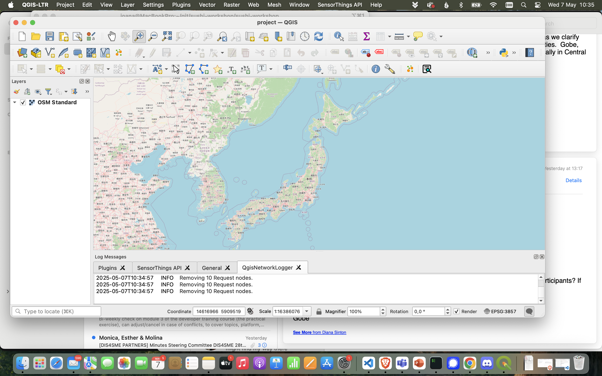
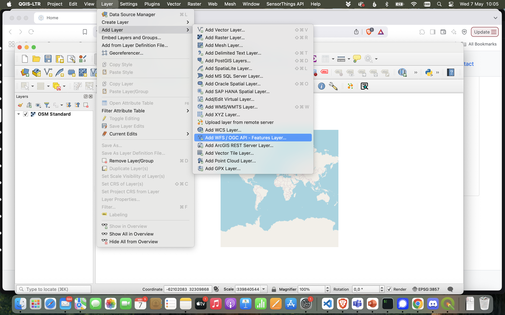
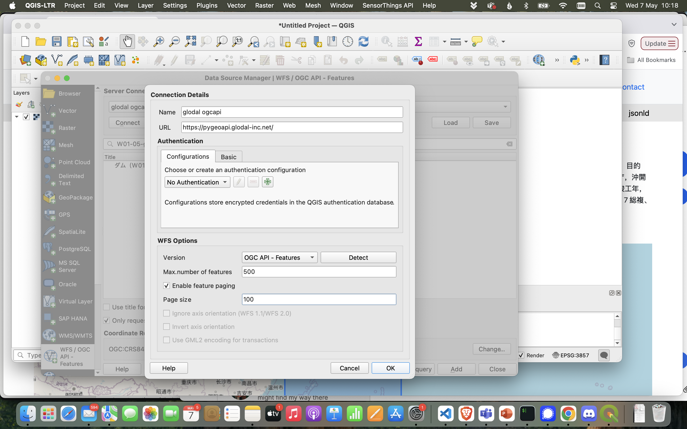
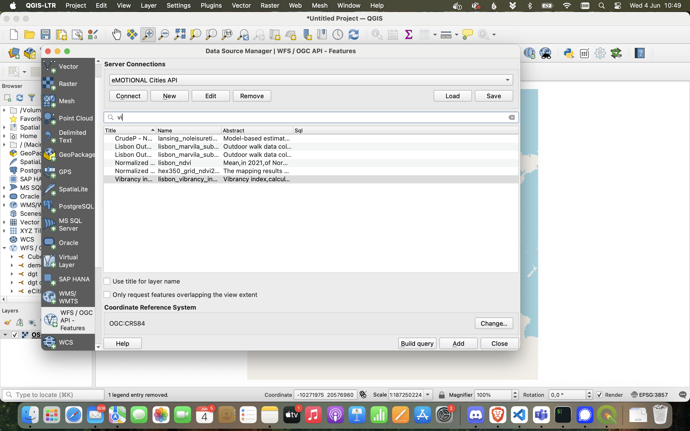
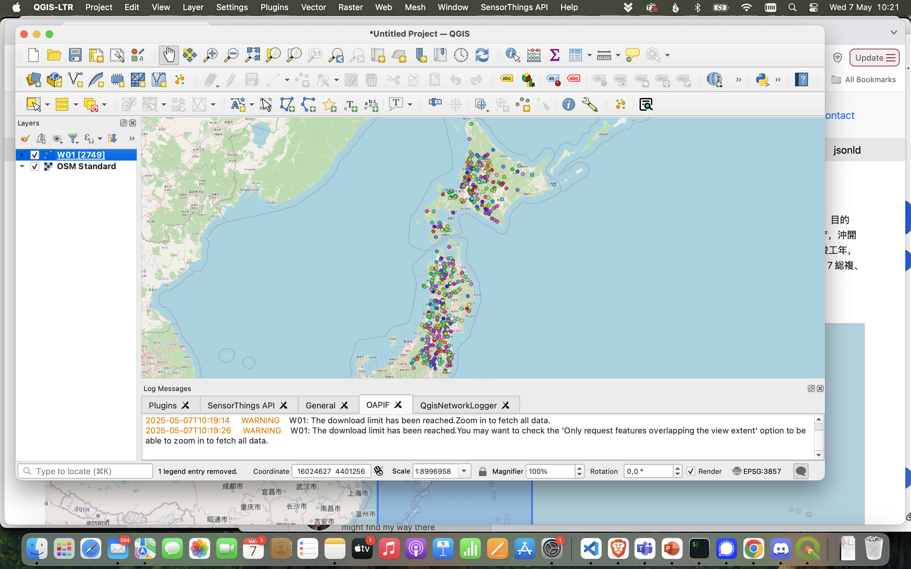

## QGIS

*[QGIS](https://qgis.org/) is a geographic information system (GIS) software that is free and open-source. QGIS supports Windows, macOS, and Linux. It supports viewing, editing, printing, and analysis of geospatial data in a range of data formats* (Wikipedia).

1. Add a context map (QuickMapServices) and zoom to Japan.

2. `Add WFS/OGC API - Features Layer...` from the Layer menu (or browser panel).

3. Instantiate a new server connection. *Set connection details, using the landing page url and limiting the maximum number of features (500) and paging (100), for performance reasons!*

3. Add the [dam collection](https://pygeoapi.glodal-inc.net/collections/W01): `ダム（W01-05-g`.

4. Explore the collection in the QGIS map view.

