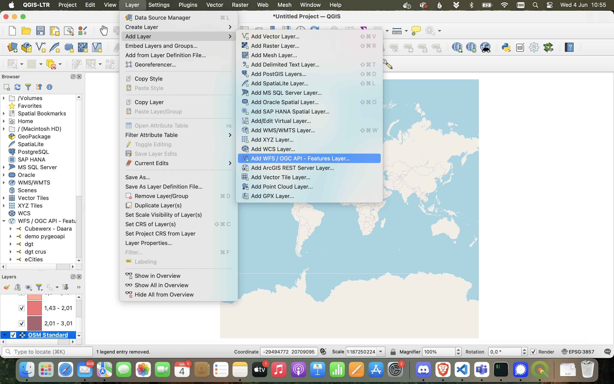

# QGIS

*[QGIS](https://qgis.org/) is a geographic information system (GIS) software that is free and open-source. QGIS supports Windows, macOS, and Linux. It supports viewing, editing, printing, and analysis of geospatial data in a range of data formats* (Wikipedia).

*[QGIS](https://qgis.org/)は、無料かつオープンソースの地理情報システム（GIS）ソフトウェアです。QGISはWindows、macOS、Linuxに対応しています。さまざまなデータ形式の地理空間データの表示、編集、印刷、分析をサポートしています*（Wikipedia）。

1. QuickMapService をインストール

`上部メニュー` > `Pugins / プラグイン` の順にクリックし `QuickMapServices`を検索してから`Install Plugin`

2. コンテキストマップ（QuickMapServices）を追加し、日本へズームインします。 　Add a context map (QuickMapServices) and zoom to Japan. 

3. `上部メニュー` > `レイヤ` > `レイヤを追加` （またはブラウザパネル）から `WFS/OGC API - 地物 レイヤーを追加...`を選択します。  `Add WFS/OGC API - Features Layer...` from the Layer menu (or browser panel).

4. 新しいサーバー接続を設定します。*`https://pygeoapi.glodal-inc.net`をURLに設定し、サーバー負荷の理由から最大特徴数（500）とページング（100）に制限します。*　 Instantiate a new server connection. *Set connection details, using the landing page url and limiting the maximum number of features (500) and paging (100), for performance reasons!*

5.  [ダムのcollection](https://pygeoapi.glodal-inc.net/collections/W01)： `ダム W01-05-g` を追加します。 Add the [dam collection](https://pygeoapi.glodal-inc.net/collections/W01): `ダム W01-05-g`.

6. 必要に応じて、レイヤーを右クリックしてコンテキストメニューを表示し、`プロパティ` を選択してスタイルを変更できます  If you want, you can change the style by right-clicking on the layer to bring up the context menu and then selecting `properties`:

7. `シンボル` タブに移動し、ドロップダウンメニューから `分類` を選択します。`値` では、色グラデーションに使用するフィールドを選択し、`分類` をクリックします。 Go to the `symbology` tab and choose `categorized` on the drop-down menu; on `value`, select the field that you want to use for the color ramp, and then click `classify`.

8. `ラベル` タブに移動し、ドロップダウンメニューから `単一定義` を選択します。`値` にはラベルに使用するフィールドを選択し、`テキストラベルを表示` と `テキストバッファを描画` のオプションを有効にします。ダイアログを閉じるために `OK` をクリックします。 Go to the `labels` tab and choose `single labels` on the drop-down menu; on `value`, select the field that you want to use for the labels, and enable the options `Draw text label` and `Color buffer's fill`; click `ok` to close the dialogue.

You can find more information on how-to style layers in QGIS on [this](https://docs.qgis.org/3.40/en/docs/user_manual/working_with_vector/vector_properties.html#index-1) and [this](https://docs.qgis.org/3.40/en/docs/training_manual/vector_classification/label_tool.html) pages of the official documentation.  
QGISでのレイヤーのスタイル設定に関する詳細情報は、[公式ドキュメント]（https://docs.qgis.org/3.40/en/docs/user_manual/working_with_vector/vector_properties. html#index-1） および [こちらの公式ドキュメント](https://docs.qgis.org/3.40/en/docs/training_manual/vector_classification/label_tool.html)を参照してください。