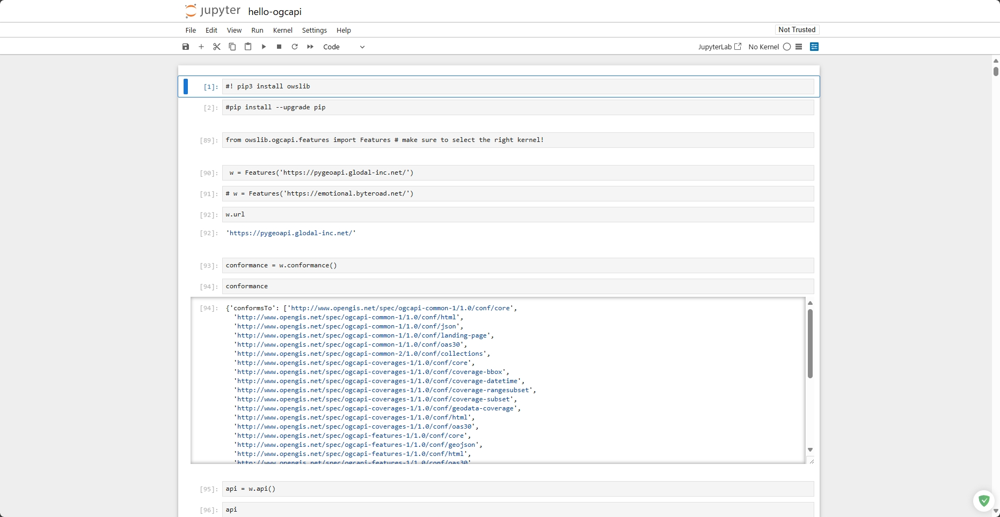

# Python/ OWSLib

In this section, we are going to use a jupyter notebook to explore an OGC API endpoint using [OWSLib](https://owslib.readthedocs.io/en/latest/).

このセクションでは、［OWSLib］（https://owslib.readthedocs.io/en/latest/） を使用して OGC API エンドポイントのcollectionを探索するために Jupyter Notebook を使用します。

*OWSLib is a Python package for client programming with Open Geospatial Consortium (OGC) web service (hence OWS) interface standards, and their related content models. (OWSLib docs)*

*OWSLib は、Open Geospatial Consortium （OGC） のウェブサービス （OWS） インターフェース標準および関連するコンテンツモデルとのクライアントプログラミング用の Python パッケージです。（OWSLib ドキュメント）*

## Windows

1. 演習用ファイルを[このページから`hello-ogcapi.ipynb`をダウンロード](https://github.com/ogcincubator/sushi-workshop/blob/master/hello-ogcapi.ipynb)。右側の [↓] アイコンをクリックする。

2. `スタートメニュー` > `すべてのプログラム` > `Anaconda (anaconda3)` > `Jupyter Notebook` をクリック

  

3. ウェブブラウザにJupyterが表示されたら、ダウンロードした`hello-ogcapi.ipynb`を`Upload`しダブルクリックして開く





## Mac 

Enter the command line on this folder and type:

このフォルダーでコマンドラインを開き、次を入力します：

``` bash
jupyter notebook
```

Click on `hello-ogcapi.ipynb` to open it.

`hello-ogcapi.ipynb` をクリックして開きます。


Follow the rest of the tutorial on the notebook.

ノートブックの残りのチュートリアルに従ってください。

