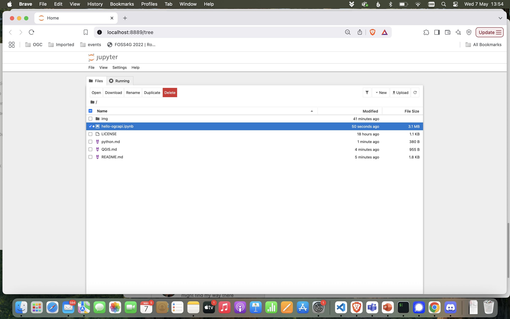

# Python/ OWSLib

In this section, we are going to use a jupyter notebook to explore an OGC API endpoint using [OWSLib](https://owslib.readthedocs.io/en/latest/).

*OWSLib is a Python package for client programming with Open Geospatial Consortium (OGC) web service (hence OWS) interface standards, and their related content models. (OWSLib docs)*

Enter the command line on this folder and type:

``` bash
jupyter notebook
```

Click on `hello-ogcapi.ipynb` to open it.



Follow the rest of the tutorial on the notebook.

