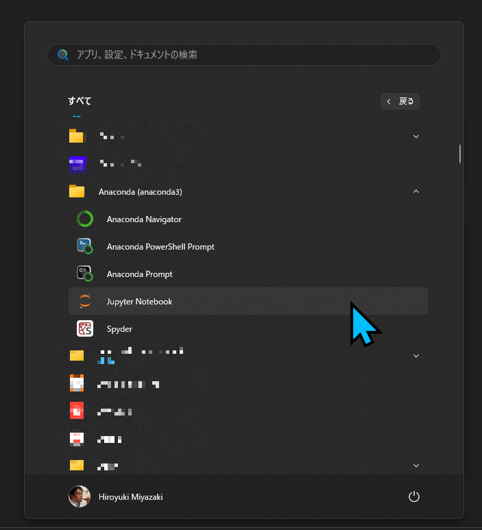

# Python/ OWSLib

In this section, we are going to use a jupyter notebook to explore an OGC API endpoint using [OWSLib](https://owslib.readthedocs.io/en/latest/).

_En esta sección, vamos a utilizar un jupyter notebook para explorar un endpoint de la OGC API usando [OWSLib](https://owslib.readthedocs.io/en/latest/)._

OWSLib is a Python package for client programming with Open Geospatial Consortium (OGC) web services (hence OWS) interface standards, and their related content models. (OWSLib docs).

_OWSLib es un paquete de Python para la programación de clientes con los estándares de interfaz de servicios web (OWS) del Open Geospatial Consortium (OGC) y sus modelos de contenido relacionados. (Documentación de OWSLib)._

## Windows (Anaconda)

1. `Anaconda (anaconda3)` > `Jupyter Notebook`

      

2. When Jupyter appears in your web browser, double-click the downloaded hello-ogcapi.ipynb to open it.| _Cuando Jupyter aparezca en su navegador web, haga doble clic en el hello-ogcapi.ipynb descargado para abrirlo._


Follow the rest of the tutorial on the notebook.| _Siga el resto del tutorial en el notebook._

## Mac/ Linux

Enter the command line on this folder and type:| _Entre en la línea de comando en esta carpeta y escriba:_

``` bash
jupyter notebook
```

Click on `hello-ogcapi.ipynb` to open it.| _Haga clic en `hello-ogcapi.ipynb` para abrirlo._


Follow the rest of the tutorial on the notebook.| _Siga el resto del tutorial en el notebook._